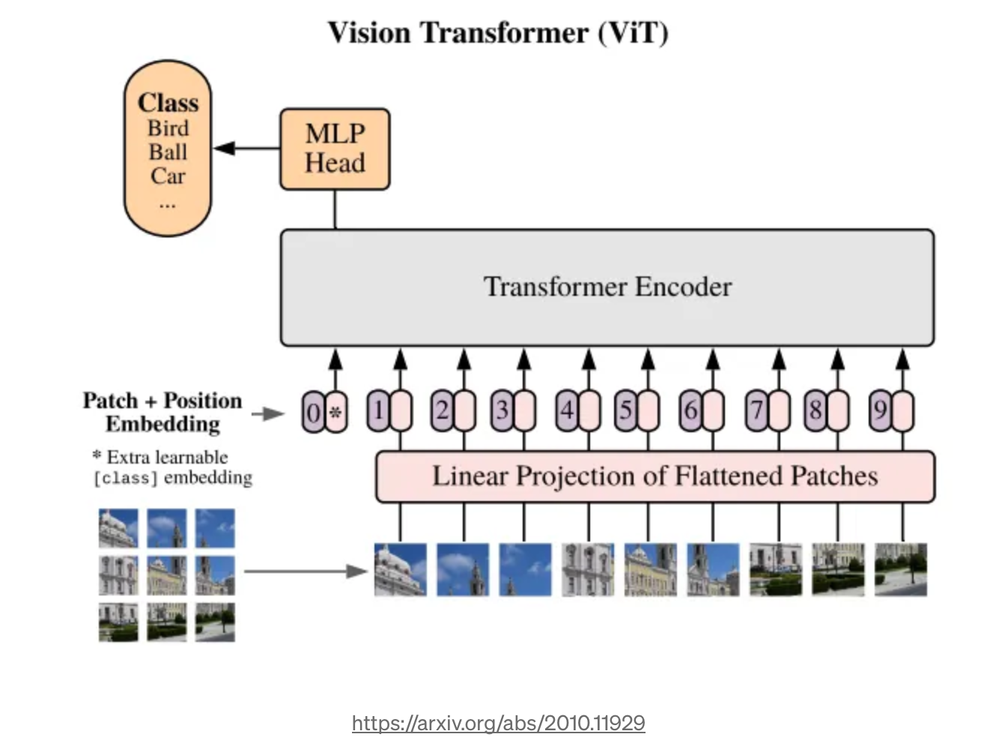

**Vision based transformers** apply the neural network architechture of the transformers originally designed for NLP.  ViT apply self-attention to detect and classify images

1. Vision Transformer (ViT) achieves remarkable results compared to convolutional neural networks (CNN) while obtaining substantially fewer computational resources for pre-training.
2. While CNNs process raw pixel values directly, ViT divides the input image into patches and transforms them into tokens. 
3. The input image is divided into square patches then each patch is lineraly transfromed into a vector called patch embeddings. This is similar to the word embeddings in transformers.
4.  The self-attention mechanism is applied through multiple encoder layers, similar to the encoders in transformers. The self-attention mechanism captures the relationships between different patches in the input sequence.
