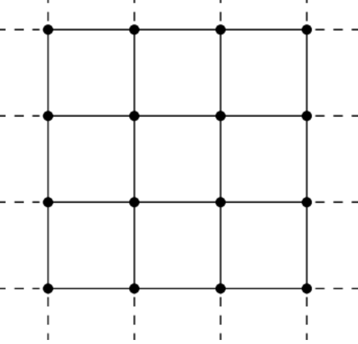

# Question 3 Part 1
## 2D Grid
### Comparing distances between 2 points in a 2D grid

To compare distance between two well defined paths, we could use **Hausdorff Distance**. The Hausdorff distance is the longest distance someone can be forced to travel by an adversary who chooses a point in one of the two paths.

It is better then other metrics like Frechet Distance(which measures the similarity between two curves) as it is less volatile to small changes in the paths.