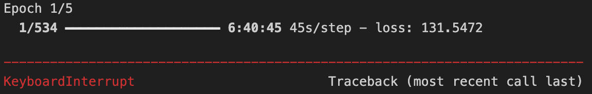

# 23b0045_AIC

## <ins>To make the code work: </ins>
1. Install the nessary libraries imported in each question by executing **pip install (library)** in the terminal.
2. Install the datasets required for each question. Further instructions on downloading the dataset are given later.
## Question 1:

**Dataset used :** I have used **PASCAL VOC 2007** dataset consisting of 20 different classes, 
Download the dataset from https://www.kaggle.com/datasets/vijayabhaskar96/pascal-voc-2007-and-2012

**Work Analysis:**
1. I have used the YOLOv1 algorithm for detecting objects as well as their bounding boxes. The model consists of a VGG model pretrained on the 'imagenet' dataset followed by 24 convolutional layers and 2 fully connected layers similar to the model in YOLOv1 paper.
2. I tried training the model on vscode but the training time was too much based on the size of the model.

3. So i ran this notebook on kaggle to use their free GPU's.

**References :**
Research Paper of YOLOv1 -- https://arxiv.org/abs/1506.02640
https://www.youtube.com/watch?v=IA3WxTTPXqQ

## Question 2:

**Dataset used :** https://investor.fb.com/investor-news/press-release-details/2024/Meta-Reports-First-Quarter-2024-Results/default.aspx

**API Keys :**
Get LLamaCloud API key from https://cloud.llamaindex.ai
Get ChatGroq API key from https://wow.groq.com

**References :**
https://aksdesai1998.medium.com/improving-rag-with-query-expansion-reranking-models-31d252856580#:~:text=FlashRank%20is%20an%20ultra%2Dlite,from%20flashrank%20import%20Ranker%2C%20RerankRequest

https://medium.com/@onkarmishra/using-langchain-for-question-answering-on-own-data-3af0a82789ed

https://www.youtube.com/watch?v=HkG06wBbTPM&t=796s
## Question 3:

**Dataset used :** https://ai.stanford.edu/%7Eamaas/data/sentiment/ 
*Execute the first code cell in P2.ipynb to download the data*

**Work Analysis :**
1. |Max Length | Embedding Dimension| Train_Accuracy| Val_Accuracy|
   |-----------| -------------------|---------| --------|
    |75         |16                 | 1       | 0.7     |
    |75         |8                  | 1       | 0.7725  |
    |100       |8                  | 1       | 0.7870   |
    |100       |12                  | 1       | 0.7805  |
    |125       |8                  | 1       | 0.7930  |
    |150      |8                  | 1       | 0.7950  |
    |150      |10                | 1       | 0.7990  |
**Final Review :**
1. As we cannot directly feed text to a model, we need to convert the text to some mathematical form. This is where word embeddings come to play.
2. Word embeddings vectorize a word. Similar words have similar embeddings. This similarity is checked through cosine similarity. The main reason we choose word  embeddings is that they can capture relationship between words during training.
3. Word embeddings are better than one-hot encoding as in a one-hot encoding with a dictionary size of aroud 10000, a particular word will be represented by 9999 0's and 1 1's which is very inefficient.

**References :** https://www.tensorflow.org/text/guide/word_embeddings
